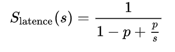
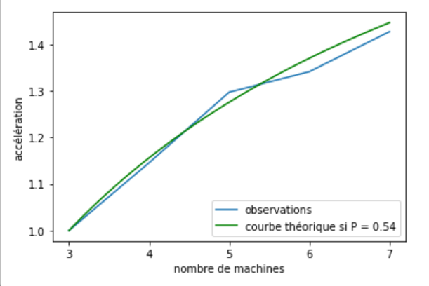
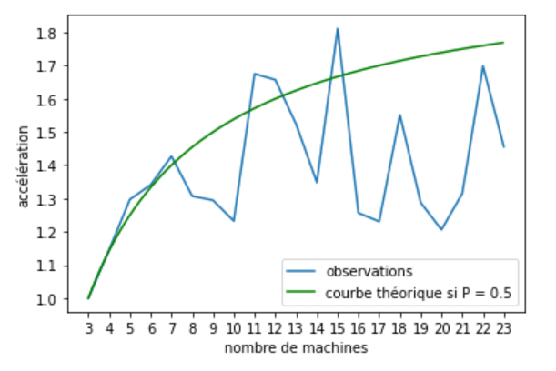

__Mathieu Serandour__  

# Rapport SLR207

Mon implémentation permet de mettre en valeur la loi de Amdahl.
L'algorithme de comtpage d'occurences dans un texte a une complexité de O(n²).
Sur un gros fichier (ici ~ 230 MiB), l'usage de cet algorithme demande une grande
puissance de calcul. 

Afin de parallèliser cet algorithme, j'ai appliquant la méthode proposée en cours.
Cette methode découpe le problème en plusieurs étapes:
- __split__: Le client découpe le fichier en plusieurs parties de taille égale, puis l'envoi aux différents serveurs.  

- __map__: Les serveurs appliquent l'algorithme sur leur partie respective.  

- __shuffle__: Les serveurs se spécialisent sur un type de mot. Chaque serveur envoi les occurences des mots aux bons autres serveurs. Ainsi,
chaque serveur garde une partie de la liste des occurences.  

- __gather__: Le serveur récupère les occurences des mots de chaque serveur.  

Il est intéréssant de distribuer un tel algoritme dés lors que sa complexité est plus élevée que O(n).
En effet, le cout de la distribution (methode split et gather) requierent d'envoyer la donnée d'entré
ce qui est seulement faisable en O(n) (C'est du moins le cas lors d'une distribution entre plusieurs
machines, cette contrainte n'apparait pas lors de l'utilisations de plusieurs threads sur une seule machine).

Le but de ce projet est de paralleliser le plus possible l'algorithme de comtpage d'occurences. J'ai éprouvé le problème suivant : Les caractères considérés sont unicodes, donc sont codés sur un nombre variable d'octets. Avec Java il ne me semble pas possible de partitionner un fichier en plusieurs parties de taille égales sans compter les charactères ou les lignes. Une étape de compléxité linéaire est donc ajoutée à la part non paralellisable de l'algorithme.

On essaie de mettre en valeur la loi de Amdahl: 

L'algorithme utilisé a l'inconvénient d'utiliser beaucoup de mémoire. Je n'ai pas réussi à l'utiliser pour déterminer ses performances temporelles sur une et deux machines car les machines individuellement n'ont pas assez de mémoire RAM.
La courbe ci-dessous commence donc à N = 3.

J'ai trace l'accélération en temps par rapport à l'utilisation de 3 machines, jusqu'à N = 7 machines.
On voit que la courbe expérimentale suit de près la courbe prédite par la loi de Amdahl. En effet, la loi d'Amdahl considère que l'execution peut être découpée en une partie parallelisable et une partie non parallelisable. Notre algorithme Inclue deux étapes non parallelisables: split et gather. Le paramètre p décrit la proportion de paralellisation de l'algorithme. On lit qu'environs 54% de l'algorithme est paralellisable (p = 0.54). La loi de Amdahl prévoit donc que la limite d'accélération de l'algorithme est  1/(1-p) = 2.17 par rapport à la vitesse obtenue avec 3 machines, soit un gain de 3.9 par rapport à la vitesse que l'on obtiendrait avec une unique machine.

L'accélération tracée en fonction  du nombre de machines est définie par la durée d'execution de l'algorithme sur 3 machines divisée par la durée d'execution pour n machines. Ainsi, l'accélération pour 3 machines est de 0.

En revanche, en essayant d'augmenter le nombre de machines, l'accélération expérimentale stagne et semble chaotique. 

